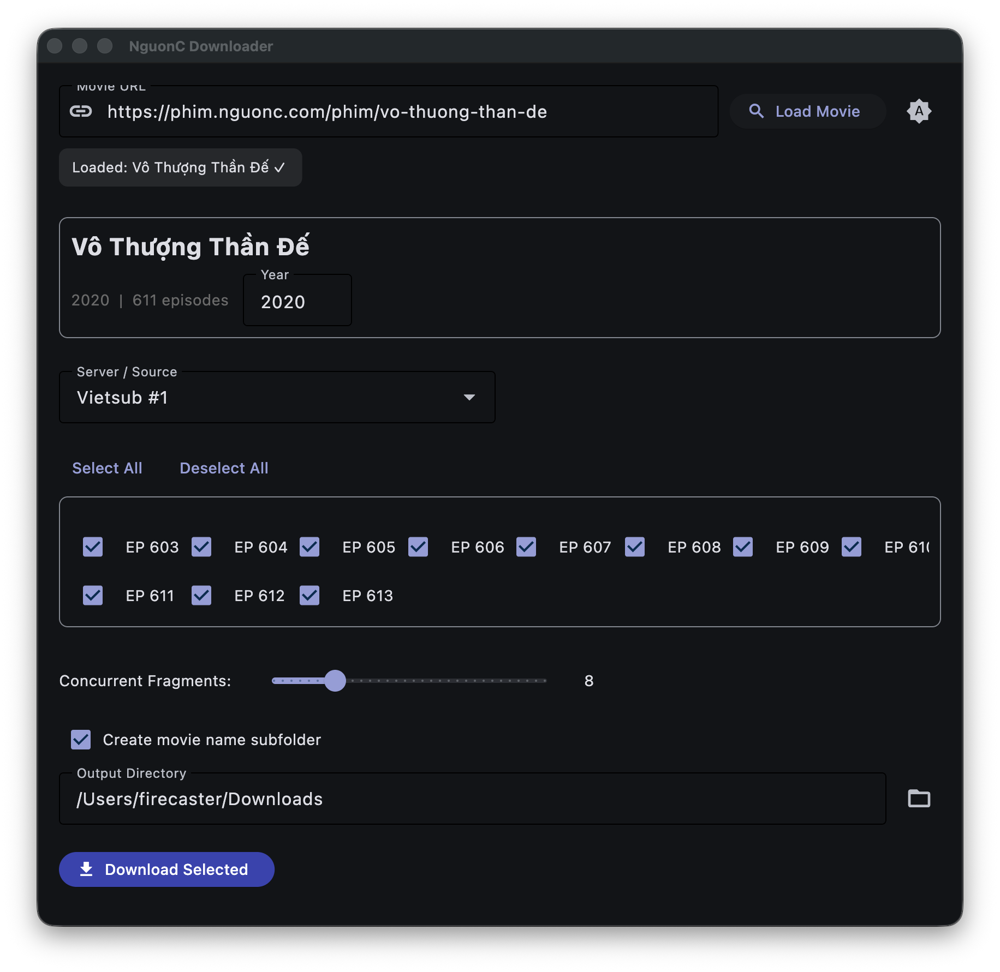

# NguonC Downloader

> **Disclaimer**: This project is for **educational and research purposes only**. It is intended to demonstrate technical concepts in web scraping, HLS video downloading, and cross-platform desktop application development. Users are responsible for complying with applicable laws and terms of service.

A cross-platform desktop app that downloads movies from **phim.nguonc.com** with maximum speed via parallel HLS fragment downloading. Built-in `yt-dlp` — no external tools needed.

## Features

- **One-click download**: Paste any movie URL from phim.nguonc.com
- **Multiple sources**: Choose between Vietsub, Thuyết minh, and other available servers
- **Batch episodes**: Select individual episodes or ranges
- **Maximum speed**: Downloads HLS segments in parallel (configurable up to 32 concurrent fragments)
- **Smart naming**: Automatically names files as `Name.S01E01.mp4`
- **Cross-platform**: Works on macOS, Windows, and Linux

## Installation

### Pre-built binaries
Download the latest release for your platform from the [Releases page](https://github.com/NinhGhoster/NguonC-Downloader/releases).

### From source
```bash
git clone https://github.com/NinhGhoster/NguonC-Downloader.git
cd nguonc-downloader
pip install -r requirements.txt
python3 nguonc_app.py
```

## Usage

1. Launch the app
2. Paste a phim.nguonc.com movie URL (e.g., `https://phim.nguonc.com/phim/mot-ngay-no`)
3. Click **Load Movie** — the app fetches title, year, servers, and episodes
4. Select the **server/source** (Vietsub, Thuyết minh, etc.)
5. Tick the **episodes** you want to download
6. Adjust **Concurrent Fragments** slider (higher = faster, default 8)
7. Choose an **output directory**
8. Click **Download Selected**



## How It Works

1. **Scrape**: Fetches the movie page and extracts episode data from embedded JSON
2. **Resolve**: For each episode, fetches the stream embed page and decodes the obfuscated HLS URL
3. **Download**: Uses `yt-dlp` (bundled) with `--concurrent-fragments N` to download HLS segments in parallel
4. **Save**: Outputs original-quality MP4 files with clean naming

## Building

### macOS
```bash
bash build_macos.sh
```
Output: `dist/NguonC Downloader.app`

### Windows
```powershell
pip install -r requirements.txt
flet pack nguonc_app.py --name "NguonC Downloader"
```

### Linux
```bash
pip install -r requirements.txt
sudo apt install libgtk-3-dev libwebkit2gtk-4.1-dev xvfb
xvfb-run flet pack nguonc_app.py --name "NguonC Downloader"
```

## Project Structure

```
nguonc-downloader/
├── assets/                  # Icons, screenshots
│   ├── icon.png
│   ├── icon.icns
│   ├── icon.ico
│   └── screenshot.png
├── nguonc_downloader.py    # Core engine: scrape, decode, download
├── nguonc_app.py           # Flet desktop GUI
├── requirements.txt        # Python dependencies
├── build_macos.sh          # macOS build script (patches Flet bundle name)
├── .github/workflows/      # CI builds for all platforms
├── AGENTS.md               # AI coding assistant notes
└── README.md               # This file
```

## Tech Stack

- **Python 3** — Core logic
- **Flet** — Cross-platform GUI (native Flutter widgets)
- **yt-dlp** — HLS downloading with parallel fragments (bundled in app)
- **PyInstaller** — App packaging

## License

GNU General Public License v3.0
